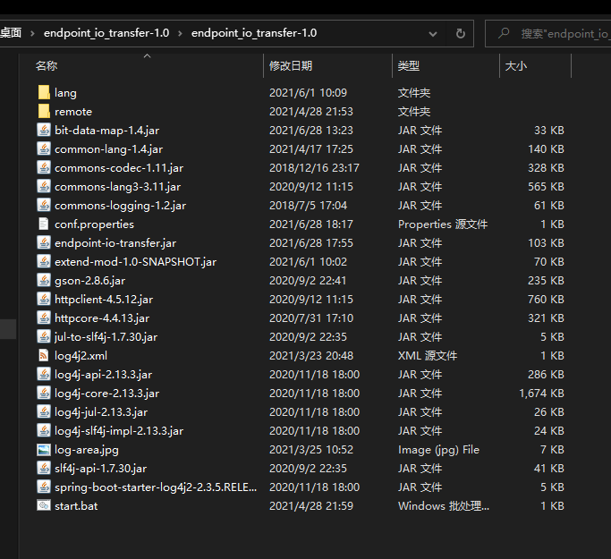
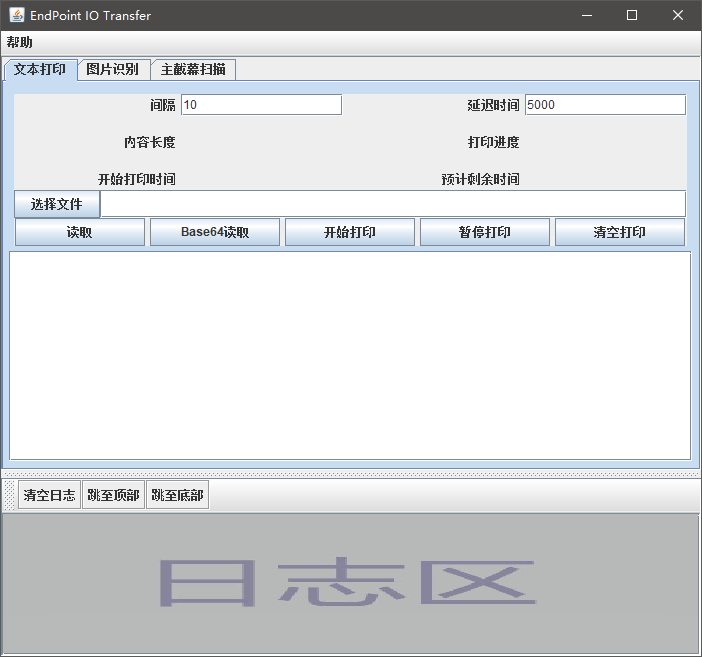

# endpoint-io-transfer

终端io传输工具, 方便远程终端设备的输入输出

- 输入: 先将文件转换为Base64编码,再通过文本打印功能将Base64编码输入至远程, 在远程再将Base64编码转换为文件
- 输出: 远程通过 remote-tool 将数据 转化为 bdmp 图片在屏幕上进行显示, 之后本地 endpoint-io-transfer 程序通过识别屏幕显示的图片, 将图片还原成文件.

> bdmp 图片详细请查看
> - <https://github.com/cosycode/bit-data-map>
> - <https://gitee.com/cosycode/bit-data-map>

## 功能介绍

1. 文本打印功能(见项目wiki)
2. 主屏幕试试扫描,并解析bdmp图片为文件
3. 远程生成图片并自动播放幻灯片

   将远程文件夹里面的文件转换成bdmp图片, 并循环播放幻灯片.
   > 生成方式请参考下面的 [remote-tool命令](#remote-tool.jar)

3. 将 remote-tool 传输至远程终端.

## 下载部署使用

### 环境准备

1. 本地电脑及远程桌面需要安装java1.8+运行环境.
   > 该程序是使用Java1.8编写的jar程序.
2. 远程桌面是正常可以操作的OS系统.

## 一, 下载`endpoint-io-transfer`压缩包并解压

1. 在该项目Releases中下载最新的压缩包, 例如 `endpoint_io_transfer-1.0.rar`

2. 解压压缩包

   解压后如下图文件如下图显示

   

## 二, 运行

   方式一: 若安装并配置好`javaw`运行配置, 则双击 `endpoint-io-transfer.jar` 即可运行.

   方式二: 点击`start.bat`运行

   运行后显示如下界面

   

## 三, 将 remote 文件夹下的内容拷贝到远程桌面.

   如果可以直接往往远程拷贝文件的话, 则就按你的方式拷贝文件, 然后就可以跳过此步骤!

   如果不可以通过文件传输传到远程终端, 可以通过 `endpoint_io_transfer` 的**文本打印功能**将文件输入进远程桌面

   操作步骤见 [将非文本文件以文本打印功能传输至远程终端](/panel/demo-in-transfer.md)

## 四, 远程相关配置

