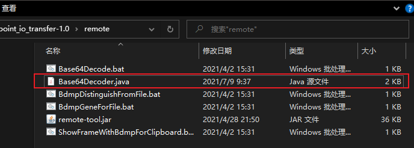
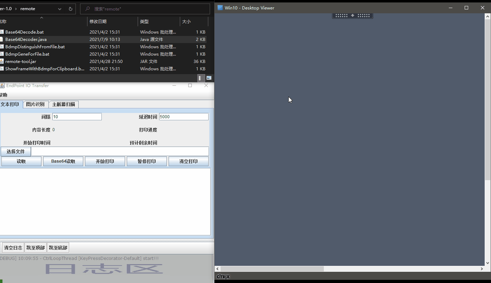
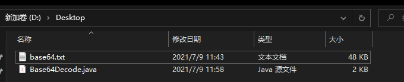
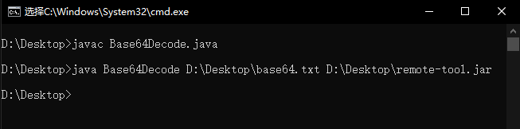
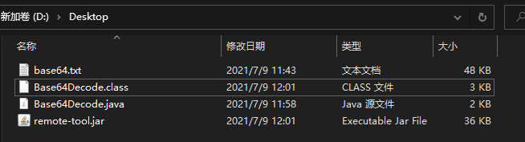

# 将非文本文件以文本打印功能传输至远程终端

1. 将文件转换成Base64编码, 再显示到 `endpoint_io_transfer` 的文本打印功能的输入框中.

   > 通过`endpoint_io_transfer`的Base64位读取文件成Base64编码演示示例.
   

2. 通过文本打印功能将编码输入到远程(可能有点慢)

   1. 在远程建立txt文本, 并使用记事本打开(最好是系统自带记事本)
   2. 将本地和远程的输入法均切换至英文
   3. 点击本地电脑`endpoint_io_transfer`的打印按钮, 并在5秒内将光标移动至远程桌面的空白记事本中
   4. 等待`endpoint_io_transfer`将输入框中的内容一点点的输入到远程桌面, 待打印完毕后, 远程记事本保存.

3. 在远程桌面编写 `Base64` 编码解析脚本

   > 如果远程有Base64解码工具, 则可以直接使用, 若没有请参考下面的步骤建立起简单的工具解析`Base64`编码成文件.
   > `remote-tool.jar` 是有封装`Base64`编码解析工具的, 但前提是你需要先把`remote-tool.jar`弄到远程桌面.

   下载的`endpoint_io_transfer`压缩包的 remote 文件夹里面应该有一个 `Base64Decode.java` 文件, 先将这个文件通过文本打印功能输入到远程桌面

   `Base64Decode.java` 文件示例如下

   > `Base64Decode.java`的作用是将Base64编码解析成一个文件.

   ```java
   import java.io.*;
   import java.nio.file.FileSystemException;
   import java.util.Base64;

   public class Base64Decode {

      /**
      * 将Base64编码文件转换为文件
      *
      * @param args -f 待转换的Base64编码文件路径
      *             -d 转换文件的保存位置
      * @throws IOException 文件不存在或读取失败
      */
      @SuppressWarnings("java:S106")
      public static void main(String[] args) throws IOException {
         final String filePath = args[0];
         File file = new File(filePath);
         if (!file.exists()) {
               throw new FileNotFoundException("文件不存在 ==> " + filePath);
         }
         if (!file.isFile()) {
               throw new FileSystemException("不是文件 ==> " + filePath);
         }
         String savePath = "";
         if (args[1] == null || args[1].trim().isEmpty()) {
            savePath = file.getParentFile().getPath() + File.separator + "base64DecodeFile";
         } else {
            savePath = args[1];
         }
         try (FileReader reader = new FileReader(file)) {
               char[] chars = new char[(int) file.length()];
               final int read = reader.read(chars);
               System.out.println("读取字符数量 ==> " + read);
               String base64 = new String(chars);
               base64 = base64.trim();
               byte[] bytes = Base64.getDecoder().decode(base64);
               writeFile(savePath, bytes);
         } catch (IOException e) {
               e.printStackTrace();
         }
      }

      public static void writeFile(String savePath, byte[] content) {
         final File file = new File(savePath);
         try (final FileOutputStream writer = new FileOutputStream(file)) {
               writer.write(content);
         } catch (IOException e) {
               e.printStackTrace();
         }
      }
   }
   ```


   操作示例  
   > gif图片里面java文件名随便输的, 输错了，改过来就行了, 改成和类名相同的

4. 利用 Base64Decode.java 还原Base64位编码文件为`remote-tool.jar`

   > 此时远程终端应该有这两个文件, 当前示例中 文件存放在 `D:\Desktop\` 文件夹里.
   > 
   > 
   > - base64.txt: 步骤2输入的Base64位编码文件
   > - Base64Decode.java: 步骤3 输入的java文件

   1. 在文件所在文件夹打开 cmd 窗口 
   2. 将 Base64Decode.java 成 class 源文件

      ```bat
      javac Base64Decode.java
      ```

   3. 利用 Base64Decode.class 解码 `base64.txt` 文件为 `remote-tool.jar`
      > 注意路径需要是全路径
      ```bat
      java Base64Decode D:\Desktop\base64.txt D:\Desktop\remote-tool.jar
      ```

   

   

> 操作成功后, 就可以将 `remote-tool.jar` 以外的文件全删掉了, 因为`remote-tool.jar`里面内置了`Base64`解码的相关功能
