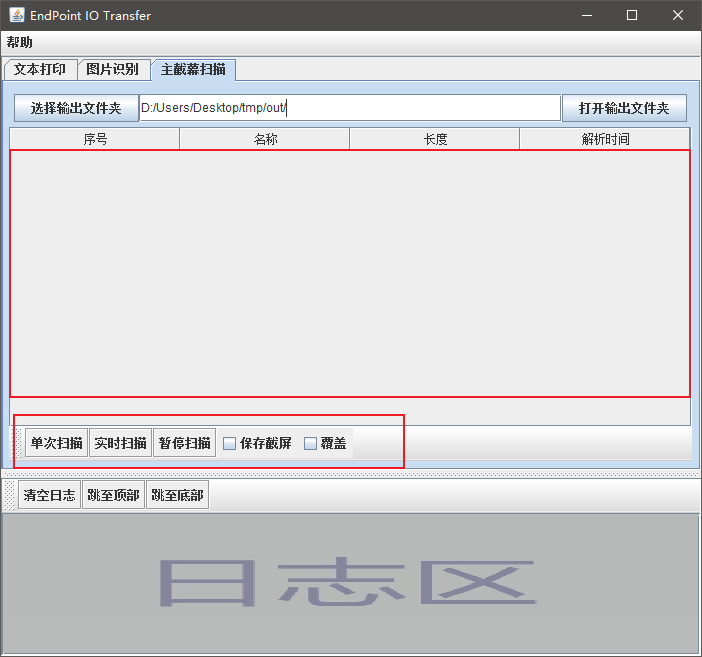

# 主屏幕扫描

可以自动识别主屏幕的`bit-data-map`, 并将其转换成文件或数据, 若`bit-data-map`内容是一个文件, 会列在下面的表格中

> 主屏幕: 若只有一个屏幕, 则这个屏幕就是主屏幕, 若有外接屏幕, 则主屏幕指的是OS系统设定的主屏幕

## 组件介绍

### 按钮点击事件

1. 选择输出文件夹: 弹出文件夹选择框, 选择输出文件夹
2. 打开输出文件夹: 系统文件浏览器打开`文件路径输入框`中的文件夹
3. 单次扫描: 对主屏幕进行截屏, 并分析是否是`bit-data-map`, 若是, 则对其进行解析成文件或数据, 保存在本地(`文件路径输入框`所指向的文件夹)
4. 实时扫描: 每秒执行一次`单次扫描`的操作.
5. 暂停扫描: 暂停扫描操作
6. 保存截屏: 若选中, 则截取主屏幕后, 会将截取的图片保存在本地(`文件路径输入框`所指向的文件夹)
7. 覆盖: 选中后, 若截屏解析`bit-data-map`出来的文件名在本地文件夹中已存在, 则进行覆盖, 若该复选框未选中, 则直接废弃最新的`bit-data-map`数据.
