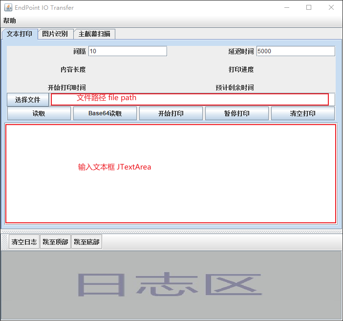
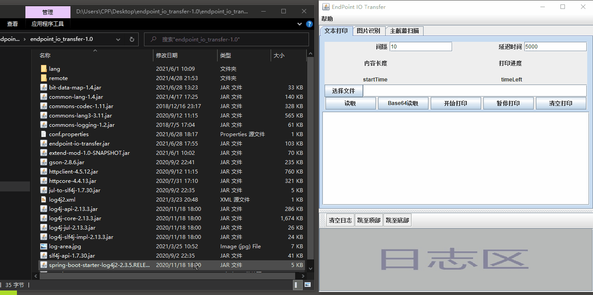
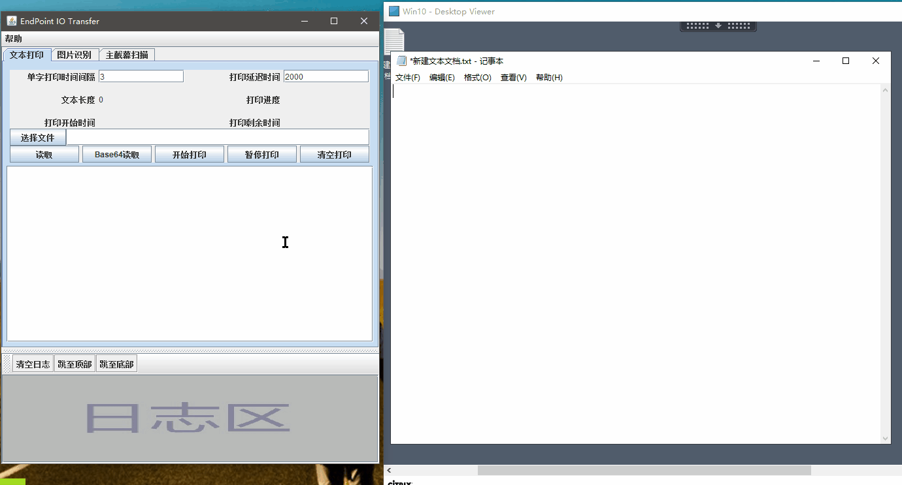

# 文本打印功能介绍

模拟按键功能, 向窗口粘贴文本后, 等待 2000 毫秒(看图中配置), 程序会模拟按键输入文本数据.

> 这是一个简单的模拟按键的功能, 可输出中文, 可以解决本地无法通过粘贴功能往远程输出文本的情况.

## 相关组件介绍

1. 交互输入框介绍

   - 间隔: 循环打印每个字符间的延迟时间(毫秒)
   - 延迟时间: 点击开始打印按钮到开始打印之间的延迟时间(毫秒), 它的目的是为了给一个
   - 文件路径输入框: 交互输入和显示读取的文件路径(可拖拽文件到输入框)
   - 输入文本框: 交互输入和显示需要打印的内容

2. 按钮介绍(点击按钮事件)

   - 选择文件: 弹出选择文件对话框, 选择文件后会在右侧`文件路径输入框`中显示出文件路径.
   - 读取(用于文本文件的读取): 会读取`文件路径输入框`中的内容, 并查找指定的文件, 若成功找到文件, 会读取文件内容, 并将内容在`输入文本框`中显示出来
   - Base64读取(用于非文本文件的读取): 会读取`文件路径输入框`中的内容, 并查找指定的文件, 若成功找到文件, 会读取文件内容, 将内容转换成`Base64`编码, 并将转换后的在`输入文本框`中显示出来
   - **开始打印(主要功能)**: 首先延迟一定时间(延迟时间参考输入框`延迟事件`设置的值), 之后读取`输入文本框`中的内容, , 并模拟键盘按键模拟键盘敲击`输入文本框`中的内容, 一个字一个字的敲击(敲击速率参考`间隔`输入框设置的值), 直到所有文本模拟打印完成.
   - 暂停打印: 暂停打印
   - 清空打印: 清空`输入文本框`中的内容

## 简单操作

1. 非文本文件读取(Base64读取)演示

   > 

2. 文本打印功能演示

   >如下图所示, 左侧是本地程序, 右侧是远程桌面, 将本文粘贴到左侧窗口, 点击开始打印后, 将鼠标焦点切换至远程桌面的记事本中, 本地程序实现将左侧文本数据输出至远程桌面.
   > 

## 注意

- 打印时需要将输入法调制英文
- 打印可以打印中文, 但是输入法依然需要设置为英文输入法
