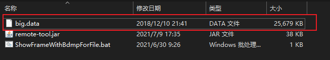
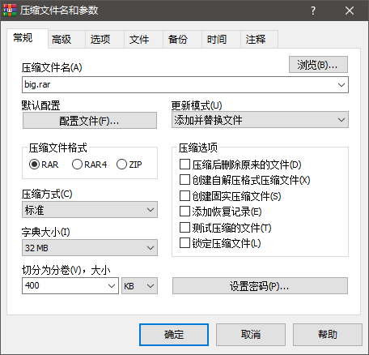
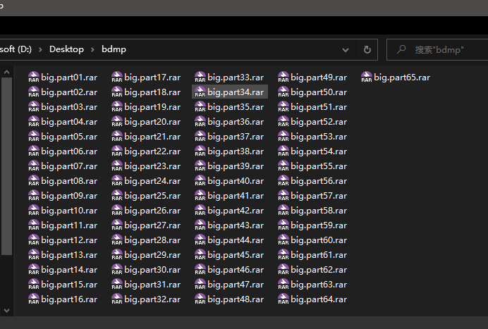
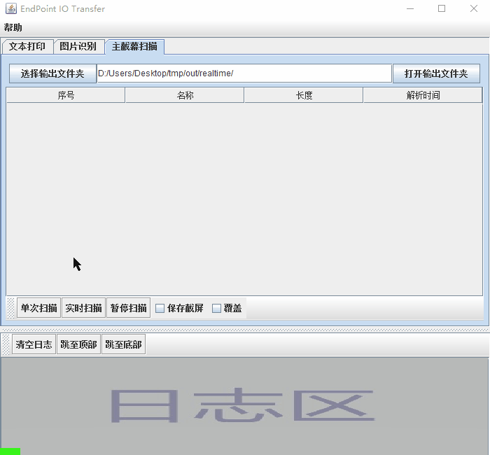
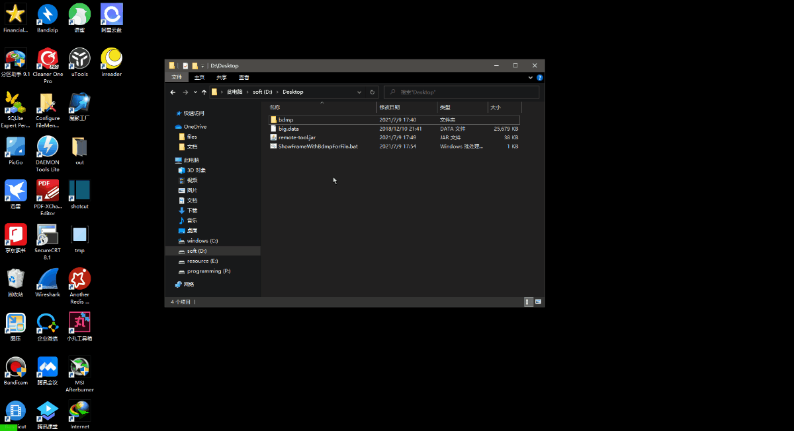
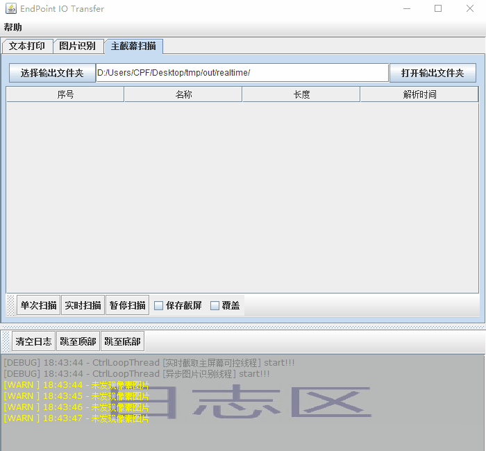

# 数据输出示例

## 数据传出方式

1. 远程小文件传出
2. 远程大文件传出
3. 远程粘贴板内容传出到本地系统粘贴板(只支持文本格式)

## 远程大文件传出

   

看上面的 `big.data` 文件(25M大小), 如何从远程取出来呢?

1. 先将 `big.demo` 文件压缩成 `分卷400K` 的小文件, 并放到一个空文件夹里面

   > 
   > 压缩成了 65 个小文件, 每个最大 400K.
   将压缩的文件放到新建的`bdmp` 文件夹, 如下图所示
   > 
   
2. 本地电脑运行 `endpoint-io-transfer.jar`, 并到主线程扫描页面, 进行实时扫描

   

3. 播放文件`bit-data-map`图: 将 `bdmp` 文件夹拖拽到 `ShowFrameWithBdmpForFile.bat` 上运行.

   > 或启动命令行运行`ShowFrameWithBdmpForFile.bat`也行, 将文件夹路径作为参数, 一样的效果!!!

   `ShowFrameWithBdmpForFile.bat`代码

   ```bat
   @echo off

   set appJar="remote-tool.jar"
   echo path: %1

   java -cp %appJar% cn.cpf.man.ShowFrameWithBdmpForFile -p %1 -r 920 -px 2 -m 15 -p2 8 -inv 1000 -maxlen 409600
   pause
   ```

   > 参数详情请看API: [cn.cpf.man.ShowFrameWithBdmpForFile](/api/api-remote-tool.md)

   `ShowFrameWithBdmpForFile.bat` 会对文件夹中的文件进行循环处理, 将其中的每个小于等于400K的文件转换成`bit-data-map`图片并显示出来.

   

3. 接下来就会在`endpoint-io-transfer.jar`面板看到本地获取的文件

   


